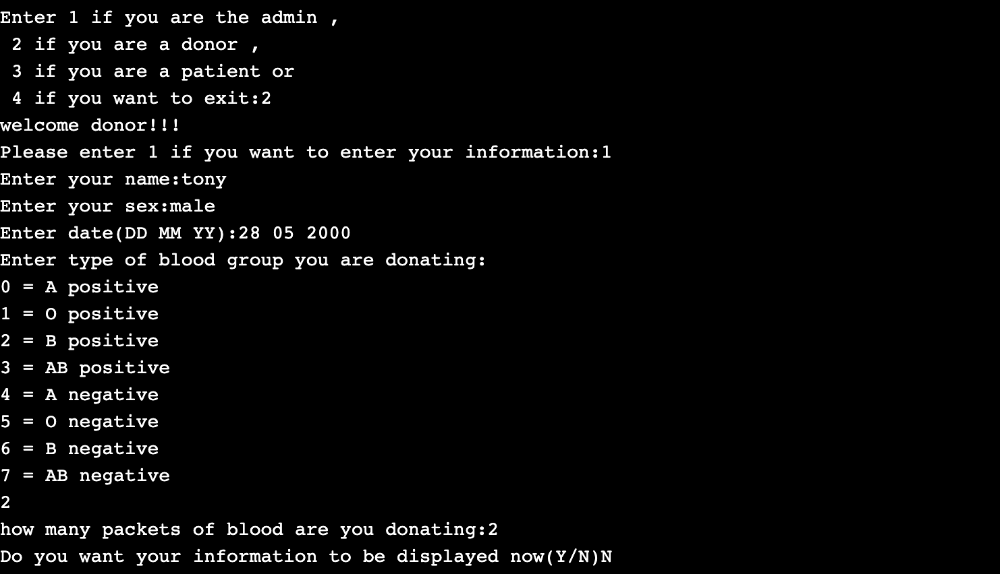
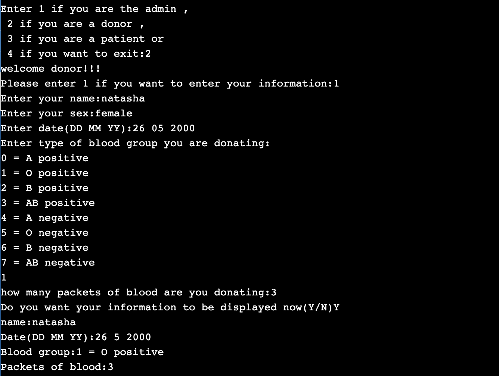
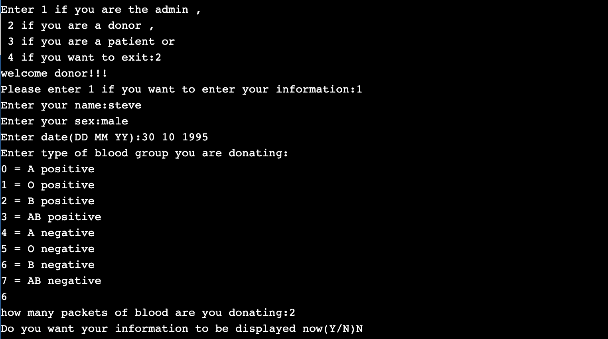
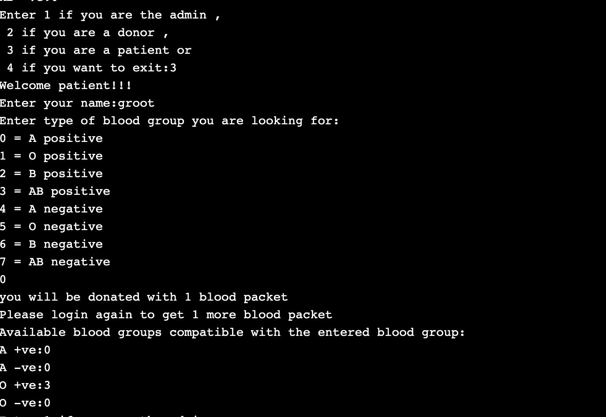
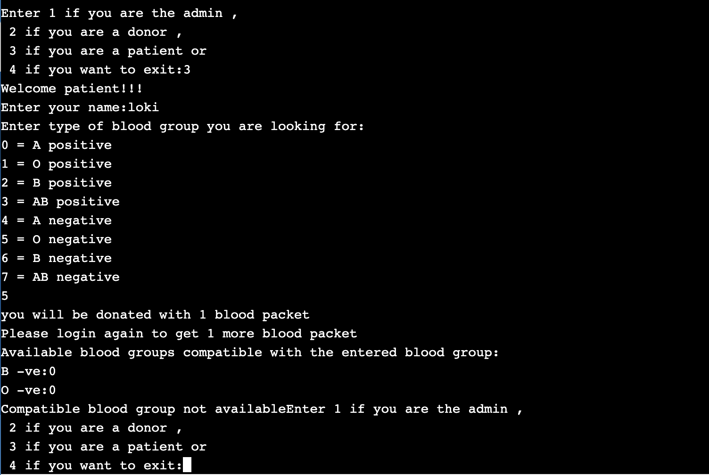

# BLOOD DONATION SYSTEM

A C++ program has been designed so as to implement blood donation system in a very small scale. 
There are four classes,namely 
1. blood_bank, 
2. admin, 
3. donor and 
4. patient.

## Description of Classes

The *blood bank* class contains an array of static int variable named blood group which stores the number of packets available in each blood group currently.
The *Administrators* can see the number of packets of blood available for each blood group through the admin class by entering the password.
*Donors* can login to enter their details and can donate any number of blood packets 
*Patients* can login and borrow 1 packet at a time. Patinets can borrow any of the compatible blood groups.

## Outputs

### Welcome

### Donors 

### Admin

### Patient ( when the blood group is present in the blood bank)

### Patient ( when the blood group is not present in the blood bank)

Thanks for reading :)
